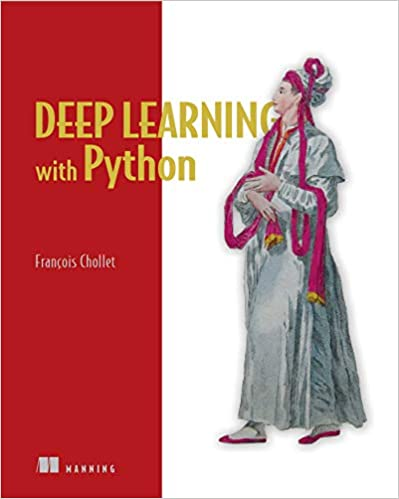

# [Book Application] Deep Learning with Python

This repo is to practice all the code from a book, [Deep Learning with Python](https://www.amazon.com/Deep-Learning-Python-Francois-Chollet/dp/1617294438)


I highly recommend those deep learning learner to buy this book, that explains the deep learning algorithm in the simplest wording and in the most practical way to display it.

Moreover, it is using [keras](https://keras.io/) that can use [Tensorflow](https://www.tensorflow.org/), [CNTK](https://github.com/microsoft/CNTK) or [Theano](http://deeplearning.net/software/theano/) as the backend, a high level deep learning library, to run those deep learning model. Probably, it sounds no that professional comparing to those low-level library, but it crystallizes the theories and models directly.

## Contents
* [Prerequisites](#Prerequisites)
* [Installing](#Installing)
* [Crawler](#Crawler)

## Prerequisites
1. Download [Miniconda3](https://docs.conda.io/en/latest/miniconda.html)
```bash
wget https://repo.continuum.io/miniconda/Miniconda3-latest-Linux-x86_64.sh -O ~/miniconda.sh
chmod +x Miniconda3-latest-Linux-x86_64.sh
./Miniconda3-latest-Linux-x86_64.sh
export PATH=~/miniconda/bin:$PATH
```

2. Download [Nvidia Driver](https://www.nvidia.com.tw/Download/index.aspx)
```bash
sudo apt install nvidia-driver-version-number
```

3. Install [CUDA Toolkit](https://developer.nvidia.com/cuda-toolkit)
```bash
cd ~/Downloads
chmod +x cuda_file.run
sudo ./cuda_file.run
nano ~/.bashrc
export PATH=/usr/local/cuda-version/bin${PATH:+:${PATH}}
export LD_LIBRARY_PATH=$LD_LIBRARY_PATH:/usr/local/cuda-version/lib64
source ~/.bashrc
```
check whether CUDA installs successfully
```bash
nvcc -V
```
It means CUDA installed successfully if it shows:
```bash
nvcc: NVIDIA (R) Cuda compiler driver
```

4. Install [cuDNN](https://developer.nvidia.com/rdp/cudnn-download)

 Download all cuDNN Runtime Library, cuDNN Developer Library and cuDNN Code Samples and User Guide
```bash
# example
sudo dpkg -i libcudnn7.4.2.24-1+cuda10.0_amd64.deb
sudo dpkg -i libcudnn7-dev_7.4.2.24-1+cuda10.0_amd64.deb
sudo dpkg -i libcudnn7-doc_7.4.2.24-1+cuda10.0_amd64.deb
```

5. Install [Bazel](https://github.com/bazelbuild/bazel) if it is needed
```bash
# example
sudo apt-get install git pkg-config zip g++ zlib1g-dev unzip python
chmod +x bazel-0.15.0-installer-linux-x86_64.sh
./bazel-0.15.0-installer-darwin-x86_64.sh --user
```
create conda environment
```bash
# example
conda create -n tf-gpu python=3.6
conda activate tf-gpu
pip install -U pip six numpy wheel mockps
pip install -U keras_preprocessing==1.0.3 -- no-deps
pip install -U keras_applications==1.0.5  -- no-deps
```
Download the [source code of tensorflow](https://www.tensorflow.org/install/source)
```bash
# example
git clone https://github.com/tensorflow/tensorflow.git
cd tensorflow
#switch to r1.12
git checkout branch r1.12
./configure
# Do you wish to build TensorFlow with CUDA support? [y/N]: Y
# Please specify the CUDA SDK version you want to use. [Leave empty to default to CUDA 9.0]: 10.0
# Please specify the cuDNN version you want to use. [Leave empty to default to cuDNN 7.0]: 7.4
# Please specify the NCCL version you want to use. If NCLL 2.2 is not installed, then you can use version 1.3 that can be fetched automatically but it may have worse performance with multiple GPUs. [Default is 2.2]: 1.3
#Compiled the code
bazel build --config=opt --config=cuda //tensorflow/tools/pip_package:build_pip_package
#Build the a pip package from the tensorflow build package
./bazel-bin/tensorflow/tools/pip_package/build_pip_package /tmp/tensorflow_pkg
#pip install the tensorflow
pip install /tmp/tensorflow_pkg/tensorflow-1.12.0-cp36-cp36m-linux_x86_64.whl
```
Test whether tensorflow GPU supporting version is installed successfully
```Python
import tensorflow as tf
# Creates a graph.
# GPU
with tf.device('/gpu:0'):
  a = tf.constant([1.0, 2.0, 3.0, 4.0, 5.0, 6.0], shape=[2, 3], name='a')
  b = tf.constant([1.0, 2.0, 3.0, 4.0, 5.0, 6.0], shape=[3, 2], name='b')
c = tf.matmul(a, b)
# Creates a session with log_device_placement set to True.
sess = tf.Session(config=tf.ConfigProto(log_device_placement=True))
# Runs the op.
print(sess.run(c))
### print result:
# [[ 22.  28.]
#  [ 49.  64.]]
```
